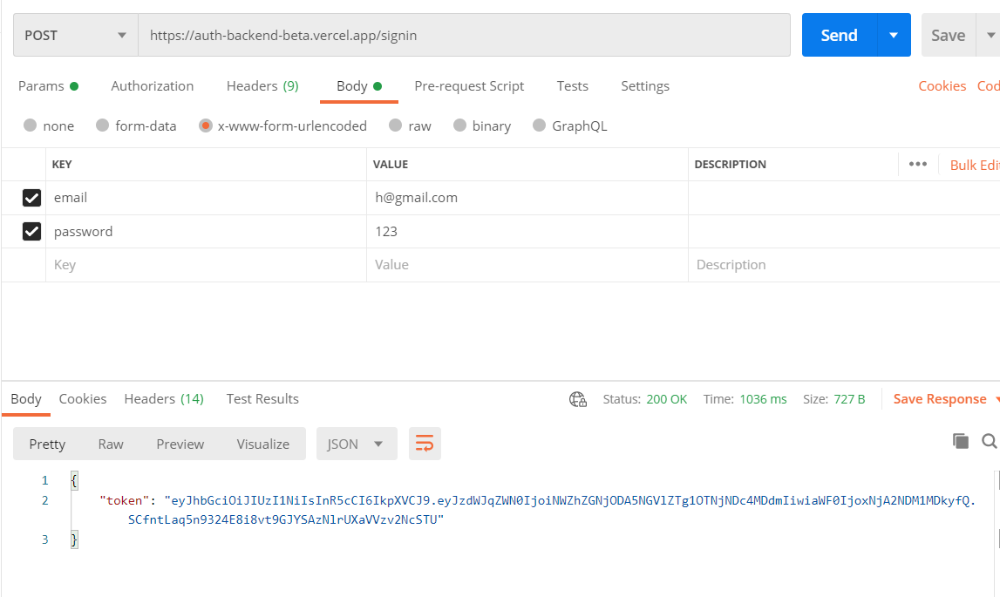
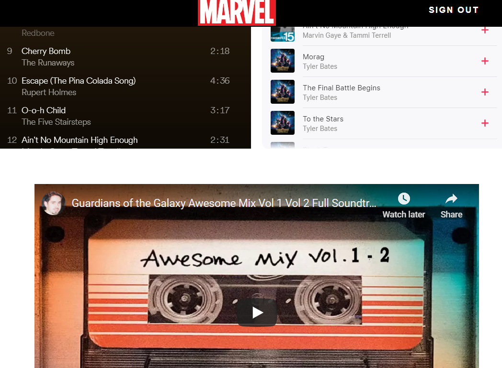

# Authentication

Able to listen to Peter Quil's songs in his 'Walkman' (From Guardians of the Galaxy) if a user is logged in. Used JWT and localstorage as authentication method. User's email and password are stored in MongoDB.

Developed with MongoDB, Mongoose, Express, Typescript, React, Redux, React-Testing-Library, JS, HTML, CSS.

Deployed front-end and back-end separately.

# Why I Built It And What I've Learned:

-   To understand the process of authentication.
-   The differences between Cookies and JWT (JWT is what this project uses).
-   The different ways of implementing authentication (We store JWT in localStorage in this project).
-   Authentication safety - CSRF (or XSRF) And XSS attacks.
-   Using HOC (Higher Order Components) to verify if a user can access a resource/page by checking if they have a JWT in browser's local storage.
-   Understanding how to test code when authentication is involved.
-   [Refresh tokens](https://www.youtube.com/watch?v=3Po7SOF9jkA&ab_channel=SaschaPreibisch) (Not used in this project; I built this project to understand the basics of JWT).

## Cookies vs JWT (JSON Web Tokens):

### Cookies:

-   Automatically included in all request (exists in the 'Header' of every request).
-   We could place information on the cookie, such as information that identifies a user.
-   Unique to each server/domain. We cannot use the cookie to another server/domain.

### JWT:

-   Have to manually set it up, unlike Cookies.
-   Can be used in different servers/domains. Suitable for applications that need to scale and applications that want to have different servers/domains (eg; having a separate mobile and web-app server).

## How Cookies and JWT are used in Authentication:

### Cookies:

1. POST request for username and password is made.
2. Check if the user information is valid by checking the database (eg; when a user signs up, check if an account hasn't already been made).
3. Store user information in the session, which is in the server memory.
4. Session will generate an ID (i.e Session ID) that will be sent back to the client as a cookie.
5. If the client needs to make another request, the session ID can be sent again as a cookie to the server. It will identify if it's the same user if the id in the cookie matches with the id in server memory.
6. Response from the server is sent.

### JWT:

1. POST request for username and password is made.
2. Check if the user information is valid by checking the database (eg; when a user signs up, check if an account hasn't already been made).
3. Server creates JWT. The JWT is an encrypted token which can be decrypted/deserialized into a JSON object containing the username and password. It will send the JWT to the client.
4. We can store the JWT in localstorage; or our database if we want to utilize refresh tokens. This way if the user refreshes the page, they still have the token.
5. If the client needs to make another request, the JWT is sent to the server. JWT will deserialize it. If the token changes / unreadable, it will return an error (eg; "Unauthorized" Error).
6. Response from the server sent.

## Why use local storage?

-   As of now, I used it to understand the basics of authentication flow. There are 'better' ways to handle JWTs such as utilizing refresh tokens.
-   https://stackoverflow.com/questions/44133536/is-it-safe-to-store-a-jwt-in-localstorage-with-reactjs
-   https://stackoverflow.com/questions/34817617/should-jwt-be-stored-in-localstorage-or-cookie
-   https://stackoverflow.com/questions/44133536/is-it-safe-to-store-a-jwt-in-localstorage-with-reactjs

## CSRF (or XSRF) And XSS Attacks:

## CSRF

-   Cross-Site Request Forgery (CSRF) steals cookies to trick the backend into thinking you are another user.
-   Happens in authenticated sessions when the server trusts the user/browser. The attacker tries to force/trick you into making a request which you did not intend. This could be sending you a link that makes you involuntarily change your password.

### XSS

-   XSS attacks enable attackers to inject client-side scripts into web pages viewed by other users. Note: SQL injection is not XSS, that's just another type of injection attack. XSS strictly speaking only affects client-side code.
-   Doesn't need an authenticated session and can be exploited when the vulnerable website doesn't do the basics of validating or escaping input.

## Examples of CSRF AND XSS:

https://l4mp1.medium.com/difference-between-xss-and-csrf-attacks-ff29e5abcd33
https://security.stackexchange.com/questions/138987/difference-between-xss-and-csrf

## React:

-   Learned how to use HOC (in requireAuth.tsx) that checks if the user has access to a resource/page by checking if the user has a JWT in the browser's local storage.

## React-Testing-Library:

-   Mocked local storage to test authentication.

### [Refresh Tokens](https://www.youtube.com/watch?v=3Po7SOF9jkA&ab_channel=SaschaPreibisch)

[A JWT token that never expires is dangerous if the token is stolen then someone can always access the user's data. For Web Apps: If you set the expiration time to 1 week, do not use the token for 1 week. Use it less than a week and get a new token before the old token expires. For example, make the browser send out a request to exchange for a new token on the sixth day. This is not different than the normal concept of session and cookies.](https://gist.github.com/soulmachine/b368ce7292ddd7f91c15accccc02b8df#:~:text=A%20JWT%20token%20that%20never,NOT%20be%20accepted%20for%20processing)

## External resources:

-   Postman to test API requests.

Such as:


-   Prettier to format code and EsLint for linting.
-   Redux dev tool google chrome extension to check the values of the states.

## What It Looks Like




# Getting Started

These instructions will get you a copy of the project up and running on your local machine for development and testing purposes.

1. Clone the project. Use `npm install` to install all the dependencies. Run the project with `npm start` for development or `npm run build` for production.

2. OPTIONAL: If you want to make changes locally, on the terminal, go to the `backend` directory. Type `npm run convert` to start the local server. The command would also listen to changes and convert the Express Typescript files to Express Javascript files that will be used for production. Make sure to include your environment variables for your mongoURI and privateKey that's used for encryption when user signs in/signs up.

# Prerequisites

What things you need to install the software

```
- Any package manager (npm, yarn)
```

# Versioning

None
